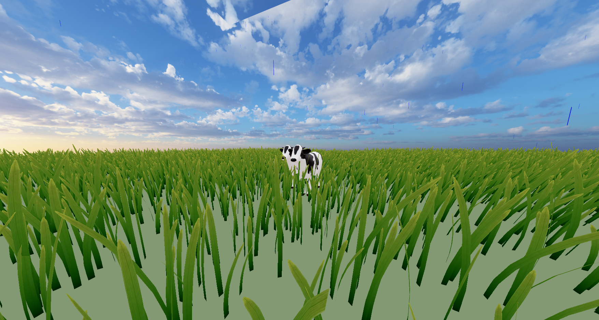

# React + Vite + React Three Fiber <del>+ Azure Blob Storage</del>

This template provides a minimal setup to get React working in Vite with HMR and some ESLint rules.

Currently, two official plugins are available:

- [@vitejs/plugin-react](https://github.com/vitejs/vite-plugin-react/blob/main/packages/plugin-react/README.md) uses [Babel](https://babeljs.io/) for Fast Refresh
- [@vitejs/plugin-react-swc](https://github.com/vitejs/vite-plugin-react-swc) uses [SWC](https://swc.rs/) for Fast Refresh

# Moo Moo




# Orignial of Grass Shader

https://codesandbox.io/p/sandbox/grass-shader-5xho4?file=%2Fpublic%2Findex.html

# Purchased Model 

https://www.turbosquid.com/3d-models/animal-collection-1775121

https://www.turbosquid.com/turbosquid-license-tiers

# ToDO

Seef if I can fix this issue: https://moo-moo-meadows.github.io/Moo-Moo-Farm/
gh-pages deployment branch is missing

# Repository Description

Moo Moo Farm is a React application using Vite as the build tool. The application leverages `@react-three/fiber` and `@react-three/drei` for 3D rendering. The main entry point of the application is `src/main.jsx`, which renders the `src/App.jsx` component. The application includes various 3D models and shaders, such as `src/cow.jsx` and `src/instancedGrass2.jsx`. Additionally, the repository includes several sound effects and background music, as seen in `src/music/music.jsx` and `src/sfx/birds.jsx`.

# Setup Instructions

1. Clone the repository:
   ```
   git clone https://github.com/ewdlop/Moo-Moo-Farm.git
   cd Moo-Moo-Farm
   ```

2. Install dependencies:
   ```
   npm install
   ```

3. Run the application:
   ```
   npm run dev
   ```

4. Build the application:
   ```
   npm run build
   ```

5. Preview the application:
   ```
   npm run preview
   ```

# Usage Instructions

- Use the arrow keys or WASD keys to move the camera around the scene.
- Interact with the 3D models by clicking on them.
- Adjust the rain drop count using the Leva control panel.
- Enjoy the background music and sound effects while exploring the farm.
